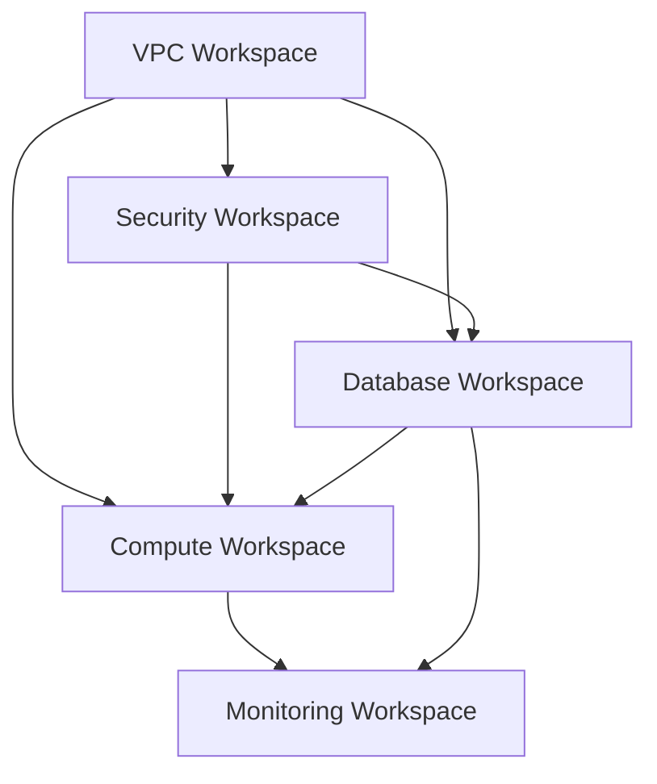

# EC2 Deployer VPC Infrastructure

This Terraform project creates a secure AWS Virtual Private Cloud (VPC) infrastructure for the "EC2 Deployer" project, designed to support multi-environment deployments with proper network segmentation, security controls, and parameter store integration.

## 🚨 Recent Security Improvements

**Critical security issues have been addressed:**

✅ **Fixed Network Architecture**: Proper separation of public and private subnets with NAT Gateway  
✅ **Updated AWS Provider**: Upgraded from v4.0.0 to v5.70+ for latest security patches  
✅ **Added KMS Encryption**: All SSM parameters now encrypted with customer-managed keys  
✅ **Removed Security Risks**: Eliminated commented credential references  
✅ **Enhanced Security Groups**: Added comprehensive security group templates  
✅ **Network Isolation**: Private subnets now properly isolated from direct internet access  
✅ **Gaming PC Security**: Added secure access patterns for cloud gaming without known IP addresses

## Architecture Overview

### Network Design

```
VPC (15.0.0.0/16)
├── Availability Zone A (us-east-1a)
│   ├── Public Subnet 01 (15.255.0.0/24)    ← ALB, NAT Gateway
│   ├── Private Subnet 01 (15.224.0.0/20)   ← EC2 Instances
│   └── Gaming Subnet (15.0.100.0/24)       ← Gaming PC (optional)
├── Availability Zone B (us-east-1b)
│   ├── Public Subnet 02 (15.240.0.0/20)    ← ALB, Bastion
│   └── Private Subnet 02 (TBD)              ← Database, Cache
│
├── Internet Gateway → Public Subnets
├── NAT Gateway (in Public Subnet 01) → Private Subnets
├── VPN Gateway → Gaming Subnet (optional)
└── Security Groups (ALB, EC2, RDS, Gaming, Default)

### Infrastructure Components

**Core Network Resources:**
- **VPC**: Custom Virtual Private Cloud (default: `15.0.0.0/16`)
- **Public Subnets**: 2 subnets for internet-facing resources (ALB, NAT Gateway)
- **Private Subnets**: 1+ subnets for internal resources (EC2, RDS, ElastiCache)
- **Gaming Subnet**: Optional dedicated subnet for gaming PC with VPN access
- **Internet Gateway**: Internet access for public subnets
- **NAT Gateway**: Secure outbound internet access for private subnets
- **VPN Gateway**: Secure access for gaming PC (optional)
- **Route Tables**: Separate routing for public, private, and gaming subnets

**Security Components:**
- **KMS Key**: Customer-managed encryption for SSM parameters
- **Security Groups**: Pre-configured templates for ALB, EC2, RDS, Gaming PC
- **Default Security Group**: Restrictive default settings
- **Gaming Security**: VPN + temporary access patterns for unknown IP addresses
- **Network ACLs**: Additional network-level security (planned)

**Integration Components:**
- **SSM Parameters**: Encrypted storage of resource IDs for cross-workspace access
- **Outputs**: Comprehensive resource references for downstream workspaces

## Multi-Workspace Architecture & Deployment Order

This VPC workspace is part of a larger multi-workspace Terraform Cloud setup. Below is the **recommended deployment order**:

### 1. 🌐 VPC Workspace (THIS REPOSITORY)
**Purpose**: Foundation network infrastructure  
**Deploys**: VPC, Subnets, IGW, NAT Gateway, Security Groups, SSM Parameters  
**Dependencies**: None (foundation layer)  
**Estimated Deploy Time**: 2-5 minutes  

### 2. 🔐 Security Workspace (ASSUMED)
**Purpose**: IAM roles, policies, KMS keys, certificate management  
**Deploys**: IAM roles, policies, additional KMS keys, ACM certificates  
**Dependencies**: VPC workspace (for VPC-specific IAM roles)  
**Estimated Deploy Time**: 1-3 minutes  

### 3. 💾 Database Workspace (ASSUMED)
**Purpose**: Managed database services  
**Deploys**: RDS instances, ElastiCache, database subnet groups  
**Dependencies**: VPC (subnets, security groups), Security (IAM roles)  
**Estimated Deploy Time**: 10-20 minutes  

### 4. 🖥️ Compute Workspace (ASSUMED)
**Purpose**: EC2 instances, Auto Scaling, Load Balancers  
**Deploys**: EC2 instances, ASG, ALB/NLB, Launch Templates  
**Dependencies**: VPC (subnets, security groups), Database (connection info)  
**Estimated Deploy Time**: 5-15 minutes  

### 5. 🔍 Monitoring Workspace (OPTIONAL)
**Purpose**: CloudWatch, monitoring, alerting  
**Dependencies**: All other workspaces for resource monitoring  
**Estimated Deploy Time**: 2-5 minutes  

### Cross-Workspace Data Flow



**Data shared via SSM Parameter Store:**
- VPC ID, Subnet IDs, Route Table IDs
- Security Group IDs, NAT Gateway ID  
- KMS Key IDs for encryption standards

## Configuration

### Prerequisites

1. **AWS Credentials**: Configure via AWS CLI, environment variables, or IAM roles
2. **Terraform Cloud Access**: Access to `EC2-DEPLOYER-DEV` organization  
3. **AWS Permissions**: VPC, EC2, IAM, KMS, SSM Parameter Store permissions
4. **KMS Permissions**: Key creation and usage permissions for parameter encryption

### Variables

| Variable | Description | Default | Type | Sensitive |
|----------|-------------|---------|------|-----------|
| `custom_vpc` | VPC CIDR block | `15.0.0.0/16` | string | No |
| `instance_tenancy` | VPC tenancy (default/dedicated) | `default` | string | No |
| `environment` | Deployment environment | `dev` | string | No |
| `parameter_base_path_prefix` | SSM parameter path prefix | `/application/ec2deployer/` | string | Yes |
| `parameter_base_path_suffix` | SSM parameter path suffix | `/resource/terraform/` | string | No |
| `enable_gaming_setup` | Enable gaming PC security setup | `true` | bool | No |
| `gaming_vpn_public_ip` | Your home public IP for VPN | `1.1.1.1` | string | Yes |
| `gaming_custom_ports` | Custom gaming ports (TCP/UDP) | `{tcp_ports=[7777,7778,7779], udp_ports=[7777,7778,7779]}` | object | No |

### Environment Support

The project supports multiple environments through the `environment` variable:
- **Development**: `environment = "dev"`
- **Staging**: `environment = "staging"`  
- **Production**: `environment = "prod"`

This affects:
- Resource naming conventions
- SSM parameter paths  
- Resource tagging
- KMS key naming

## Deployment Guide

### Initial Deployment

1. **Copy configuration template:**
   ```bash
   cp terraform.tfvars.example terraform.tfvars
   ```

2. **Edit variables** (customize for your environment):
   ```hcl
   custom_vpc = "15.0.0.0/16"
   environment = "dev"
   parameter_base_path_prefix = "/application/ec2deployer/"
   ```

3. **Deploy via Terraform Cloud:**
   - Push code to repository
   - Terraform Cloud will automatically plan and apply
   - Monitor deployment in Terraform Cloud UI

### Local Development/Testing

```bash
# Note: This requires proper AWS credentials and backend configuration
terraform init
terraform plan
terraform apply
```

## Outputs & SSM Parameters

### Terraform Outputs

The workspace provides these outputs for other workspaces:

### Terraform Outputs

The workspace provides these outputs for other workspaces:

| Output | Description | Usage |
|--------|-------------|-------|
| `vpc_id` | VPC identifier | Reference in compute workspace |
| `public_subnet_ids` | List of public subnet IDs | ALB/NLB placement |
| `private_subnet_ids` | List of private subnet IDs | EC2/RDS placement |
| `subnet_id_map` | Map of subnet names to IDs | Dynamic subnet selection |
| `igw_id` | Internet Gateway ID | Custom routing rules |
| `nat_gateway_id` | NAT Gateway ID | Monitoring and cost tracking |
| `public_rt_id` | Public route table ID | Additional route management |
| `private_rt_id` | Private route table ID | Custom private routes |
| `*_security_group_id` | Security group IDs | Reference in compute resources |
| `kms_key_id` | KMS key for parameter encryption | Consistent encryption standards |
| `root_deployment_id` | Unique deployment identifier | Resource correlation |

### SSM Parameters (Encrypted)

All parameters are stored with KMS encryption under:  
`/application/ec2deployer/{environment}/resource/terraform/`

**Network Resources:**
- `vpc-id` - VPC identifier
- `public-subnet-01` - First public subnet ID
- `public-subnet-02` - Second public subnet ID  
- `private-subnet-01` - Private subnet ID
- `public-rt-id` - Public route table ID
- `private-rt-id` - Private route table ID
- `igw-id` - Internet Gateway ID
- `nat-gateway-id` - NAT Gateway ID

**Security Resources:**
- `alb-security-group-id` - ALB security group
- `ec2-security-group-id` - EC2 security group
- `rds-security-group-id` - RDS security group

### Accessing Resources in Other Workspaces

**Method 1: Terraform Remote State (Same Organization)**
```hcl
data "terraform_remote_state" "vpc" {
  backend = "remote"
  config = {
    organization = "EC2-DEPLOYER-DEV"
    workspaces = {
      name = "vpc"
    }
  }
}

# Usage
resource "aws_instance" "example" {
  subnet_id = data.terraform_remote_state.vpc.outputs.private_subnet_ids[0]
  vpc_security_group_ids = [data.terraform_remote_state.vpc.outputs.ec2_security_group_id]
}
```

**Method 2: SSM Parameter Store (Cross-Account)**
```hcl
data "aws_ssm_parameter" "vpc_id" {
  name = "/application/ec2deployer/dev/resource/terraform/vpc-id"
}

data "aws_ssm_parameter" "private_subnet" {
  name = "/application/ec2deployer/dev/resource/terraform/private-subnet-01"
}

# Usage
resource "aws_instance" "example" {
  subnet_id = data.aws_ssm_parameter.private_subnet.value
}
```

## Security Analysis & Recommendations

### ✅ Security Issues Resolved

1. **Network Architecture Fixed**
   - ❌ **Previous**: All subnets routed through IGW (security risk)
   - ✅ **Current**: Proper public/private separation with NAT Gateway

2. **Provider Security Updated**
   - ❌ **Previous**: AWS Provider v4.0.0 (2+ years outdated)
   - ✅ **Current**: AWS Provider v5.70+ (latest security patches)

3. **Parameter Encryption Added**
   - ❌ **Previous**: Unencrypted SSM parameters
   - ✅ **Current**: KMS-encrypted parameters with customer-managed keys

4. **Credential Security Improved**  
   - ❌ **Previous**: Commented AWS credentials in code
   - ✅ **Current**: Clean code, no credential references

5. **Security Groups Implemented**
   - ❌ **Previous**: No security group templates
   - ✅ **Current**: Comprehensive security groups for ALB, EC2, RDS

### 🔐 Additional Security Recommendations

**For Compute Workspace:**
- Use IAM roles for EC2 instances (avoid access keys)
- Implement least-privilege security groups
- Enable VPC Flow Logs for network monitoring
- Use Systems Manager Session Manager instead of SSH
- Enable GuardDuty for threat detection

**For Database Workspace:**
- Enable RDS encryption at rest
- Use RDS Proxy for connection pooling and IAM authentication  
- Implement automated backups with cross-region replication
- Enable Performance Insights for monitoring

**For All Workspaces:**
- Implement Terraform state encryption
- Use separate AWS accounts for different environments
- Enable CloudTrail for audit logging
- Implement resource tagging standards (already included)
- Use AWS Config for compliance monitoring

### 🚨 Security Concerns & Monitoring

**High Priority:**
- [ ] Implement Network ACLs for additional subnet-level security
- [ ] Add VPC Flow Logs for network traffic analysis
- [ ] Enable AWS Config rules for compliance monitoring
- [ ] Set up CloudWatch alarms for unusual network activity

**Medium Priority:**
- [ ] Implement NACL rules for additional security layers
- [ ] Add WAF for public-facing applications (compute workspace)
- [ ] Enable AWS GuardDuty for threat detection
- [ ] Implement cross-region backup strategy

**Monitoring Recommendations:**
- Monitor NAT Gateway costs and usage
- Set up billing alerts for unexpected charges
- Monitor KMS key usage for parameter encryption
- Track failed authentication attempts

## Cost Optimization

**Current Costs (Estimated):**
- NAT Gateway: ~$45/month per AZ
- KMS Key: $1/month + $0.03 per 10K requests
- VPC, Subnets, IGW: Free
- Minimal security group and SSM parameter costs

**Cost Optimization Tips:**
- Consider single NAT Gateway for dev environments
- Use VPC Endpoints for AWS services to reduce NAT costs
- Monitor and right-size resources in compute workspace
- Use spot instances where appropriate (compute workspace)

## Tags and Naming Convention

Resources follow a consistent tagging strategy for governance and cost tracking:

**Common Tags Applied to All Resources:**
- `PROJECT_NAME`: ec2deployer
- `PROJECT_COMPONENT`: network-infrastructure  
- `ENVIRONMENT`: Environment (uppercased)
- `ROOT_DEPLOYMENT_ID`: Random 6-byte hex identifier for deployment correlation
- `MODULE_DEPLOYMENT_ID`: Same as root deployment ID for this workspace
- `TYPE`: Resource type (VPC, Subnet, Security Group, etc.)

**Naming Convention:**
`{project-name}-{deployment-id}-{environment}-{resource-type}`

Example: `ec2deployer-a1b2c3-DEV-vpc`

## Troubleshooting

### Common Issues

**1. NAT Gateway Deployment Failures**
```bash
# Check if IGW is properly attached
aws ec2 describe-internet-gateways --region us-east-1
```

**2. Route Table Association Errors**
- Ensure subnet count matches route table associations
- Verify AZ availability in your region

**3. KMS Key Permission Issues**
- Ensure Terraform execution role has KMS permissions
- Check KMS key policy allows parameter encryption

**4. Cross-Workspace Access Issues**
- Verify SSM parameter paths match exactly
- Check IAM permissions for parameter access
- Ensure KMS key permissions for parameter decryption

### Validation Commands

```bash
# Validate Terraform configuration
terraform validate

# Check formatting
terraform fmt -check

# Plan deployment (dry run)
terraform plan

# Verify SSM parameters (post-deployment)
aws ssm get-parameters-by-path --path "/application/ec2deployer/dev/resource/terraform/" --recursive --with-decryption
```

## Development History & Migration Notes

**Version 2.0 Changes:**
- ✅ Fixed critical network security architecture
- ✅ Updated AWS provider from v4.0.0 to v5.70+
- ✅ Added KMS encryption for all SSM parameters
- ✅ Implemented proper public/private subnet separation
- ✅ Added NAT Gateway for secure private subnet internet access
- ✅ Created comprehensive security group templates
- ✅ Enhanced documentation with deployment order and security guidance

**Breaking Changes:**
- Route table associations now properly separate public/private
- SSM parameter names updated (rt-id → public-rt-id, added private-rt-id)
- Additional parameters added for security groups and NAT Gateway

**Migration from v1.x:**
1. Update any hardcoded parameter references in compute workspace
2. Update security group references to use new template groups
3. Verify private subnet routing is working correctly
4. Update monitoring for new NAT Gateway costs

---

*Last Updated: [Current Date] - Major security improvements and architecture fixes*